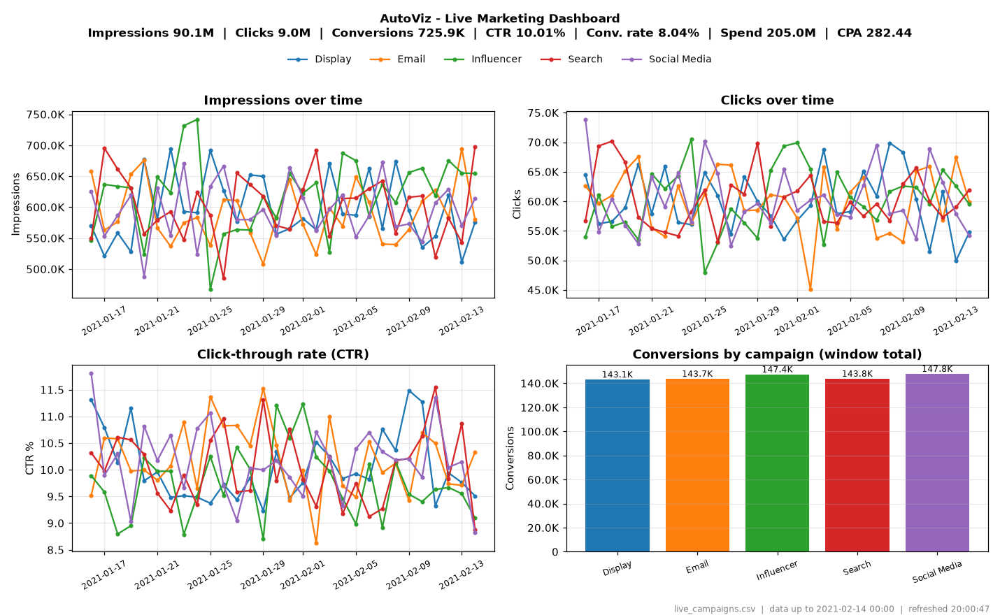

# AutoViz - Real-Time Marketing Data Plotter

AutoViz watches a CSV file of marketing campaign data and keeps a matplotlib dashboard
updated as new rows get appended. The idea is to simulate live campaign analytics for
a small team without needing a database or a web app.



## Dataset

I used the [Marketing Campaign Performance Dataset](https://www.kaggle.com/datasets/manishabhatt22/marketing-campaign-performance-dataset)
from Kaggle. It has 200,000 campaigns from 2021 across 5 campaign types (Display, Email,
Influencer, Search, Social Media). `scripts/prepare_data.py` sums it up per day and per
campaign type, which gives 1825 rows.

Column mapping:

| AutoViz      | Kaggle dataset                 |
|--------------|--------------------------------|
| timestamp    | Date                           |
| campaign     | Campaign_Type                  |
| impressions  | Impressions                    |
| clicks       | Clicks                         |
| conversions  | Clicks * Conversion_Rate       |
| spend        | Acquisition_Cost               |

The [Facebook Ad Campaign](https://www.kaggle.com/datasets/madislemsalu/facebook-ad-campaign)
dataset also works (`--source facebook`), but it's much smaller.

Both datasets are public, so they download without a Kaggle API key.

## Setup

Needs Python 3.8 or newer.

```bash
git clone <repo-url>
cd autoviz
python -m venv .venv
.venv\Scripts\activate          # Windows
source .venv/bin/activate       # macOS / Linux
pip install -r requirements.txt
```

## Usage

**1. Get the data** (already included in `data/campaign_history.csv`, so this is optional)

```bash
python scripts/prepare_data.py
```

If you downloaded the CSV from Kaggle yourself, pass it with `--input path/to/file.csv`.

**2. Start the simulated live feed** in one terminal. It appends one day of data every
2 seconds to `data/live_campaigns.csv`.

```bash
python scripts/simulate_stream.py --interval 2 --prefill 10
```

Useful flags: `--loop` to start over at the end of the year, `--bad-rows 0.3` to throw
in some broken rows and check that the dashboard handles them.

**3. Open the dashboard** in a second terminal:

```bash
python -m autoviz --csv data/live_campaigns.csv --refresh 5
```

You can also run `pip install -e .` and then just use `autoviz --csv ...`.

### Options

| Option              | Default    | What it does |
|---------------------|------------|--------------|
| `--csv PATH`        | required   | CSV file to watch |
| `--refresh SECONDS` | 5          | refresh interval |
| `--window N`        | 30         | how many of the latest timestamps to plot |
| `--max-rows N`      | 5000       | only keep the last N rows in memory |
| `--campaigns A B`   | all        | only plot these campaigns |
| `--no-watch`        | off        | don't reload as soon as the file changes, only on the interval |
| `--snapshot FILE`   |            | save the dashboard as an image and exit |
| `-v`                | off        | debug logging |

### CSV format

```
timestamp,campaign,impressions,clicks,conversions,spend
2024-06-01 10:00,Launch,1000,50,5,20.0
2024-06-01 10:05,Launch,1200,60,6,22.5
```

`spend` is optional. If it's there the header also shows total spend and cost per acquisition.

## What the dashboard shows

- Top line: total impressions, clicks, conversions, CTR, conversion rate, spend and CPA
  for the plotted window
- Impressions over time, per campaign
- Clicks over time, per campaign
- CTR over time, per campaign
- Total conversions per campaign (bar chart)
- Bottom right: source file, latest data point and when it last refreshed

## How it works

```
CSV file -> CSVDataLoader -> DataProcessor -> PlotManager -> matplotlib window
                 ^
                 |
          AutoVizController (timer loop)
```

| Module                   | Class               | Job |
|--------------------------|---------------------|-----|
| `autoviz/loader.py`      | `CSVDataLoader`     | reads the CSV, checks the columns, drops bad rows |
| `autoviz/processor.py`   | `DataProcessor`     | filters by campaign and time window, aggregates, computes CTR / conversion rate / CPA |
| `autoviz/plotter.py`     | `PlotManager`       | draws and redraws the 2x2 dashboard |
| `autoviz/controller.py`  | `AutoVizController` | runs the update loop and handles errors |
| `autoviz/cli.py`         |                     | command line arguments |

The controller checks the file every 0.5s. If it changed, the plot redraws right away;
otherwise it redraws every `--refresh` seconds. In testing, new data showed up on the
dashboard in under a second.

Bad input doesn't crash it. Missing or empty files, half-written lines, wrong column
names, text in number columns and negative values are all either skipped (with a
warning in the log) or shown as a message on the plot until the data is fixed.

## Tests

```bash
python -m unittest discover tests -v
```

The tests cover loading, bad rows, missing/empty files, schema checks, aggregation,
live update detection, recovering after the file is deleted, and CLI argument checks.
They also run on GitHub Actions for Windows, macOS and Linux.

## Project structure

```
autoviz/
    __init__.py
    __main__.py
    cli.py
    controller.py
    loader.py
    plotter.py
    processor.py
scripts/
    prepare_data.py       download + convert the Kaggle data
    simulate_stream.py    replay the data into a live CSV
tests/
    test_autoviz.py
data/
    campaign_history.csv
docs/
    dashboard.png
```

## Limitations

- The Kaggle dataset looks randomly generated, so the daily numbers are noisy and every
  campaign type ends up with roughly the same CTR. Good for testing the live updates,
  not for drawing real conclusions.
- Desktop window only, no web UI.
- The whole file is re-read on each update. That's fine for a few thousand rows but
  would need incremental reading for really large files.
